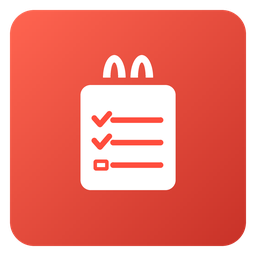
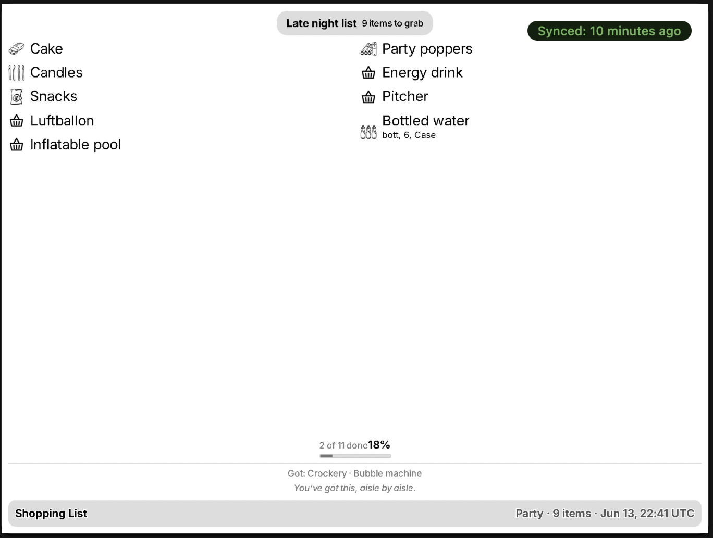
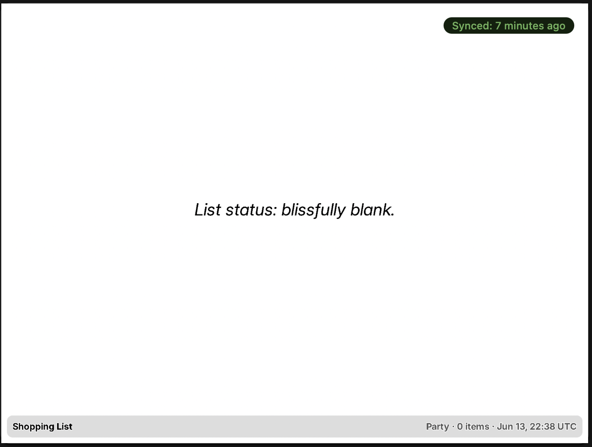

# Bring! Shopping List for TRMNL

Show your [Bring!](https://www.getbring.com/) shopping list on a [TRMNL](https://usetrmnl.com/) e-ink display. Add items from the Bring! app, Alexa, Google Home, or a shared family list — they all show up on your screen.



## Screenshots

| With items | Empty list |
|:----------:|:----------:|
|  |  |

## How it works

```
Bring! app / Alexa / Google Home / shared list
     │
     ▼
 Bring! account ──► TRMNL plugin (Cloudflare Worker) ──► your e-ink display
```

When your TRMNL device refreshes, the plugin fetches your current Bring! list and renders it. No polling delays, no cron jobs — the data is always **live**.

## Features

- **Bring! item icons** — real product illustrations from Bring!, bold black for e-ink
- **Multi-list support** — pick which Bring! list to display, switch anytime from settings
- **17 languages** — item names translated from Bring!'s internal catalog
- **Adaptive text sizing** — fewer items = bigger text to fill the screen
- **Time-based greeting** — "Good morning! 4 items to grab" header
- **Shopping progress** — progress bar showing how much of the list you've completed
- **Assigned-to badges** — on shared lists, see who needs to grab what
- **Witty empty states** — 12 rotating italic phrases when your list is clear
- **Witty footer taglines** — "Don't forget the snacks." and more
- **Recently purchased strip** — compact "Got: Milk · Eggs · ..." at the bottom
- **All 4 TRMNL layouts** — Full, Half Horizontal, Half Vertical, Quadrant

## Install (TRMNL marketplace)

If this plugin is on the TRMNL marketplace, install it with one click from your dashboard. You'll enter your Bring! email and password, pick a list and language, and you're done.

**Manage settings** anytime without reinstalling — change your list or language from the plugin management page.

## Self-host: fork & deploy (5 minutes)

If you'd rather run your own instance:

### Option A — Cloudflare Worker (recommended, live data)

The `worker/` directory contains a complete TRMNL third-party plugin running on Cloudflare Workers' free tier. See [`worker/README.md`](worker/README.md) for deployment instructions.

### Option B — GitHub Actions (zero infra, ~5 min cadence)

A simpler setup that polls Bring! every 5 minutes and pushes to a TRMNL Private Plugin via webhook.

1. **[Fork](../../fork)** this repo.
2. Add GitHub Actions secrets: `BRING_EMAIL`, `BRING_PASSWORD`, `TRMNL_PLUGIN_UUID`.
3. Create a TRMNL [Private Plugin](https://trmnl.com/plugin_settings/new?keyname=private_plugin) (Webhook strategy) and paste the templates from the `template*.liquid` files.
4. The workflow runs every 5 minutes automatically on the free tier.

## Layouts

| Layout | Columns | Features |
|--------|---------|----------|
| **Full** | 2 (manual split) | Greeting header, icons, specs, progress bar, recently-got strip, witty tagline |
| **Half Horizontal** | 2 | Icons, recently-got strip, witty tagline |
| **Half Vertical** | 1 | Icons, specs, recently-got strip, witty tagline |
| **Quadrant** | 2 | Icons, compact |

Text size scales from `title--xxlarge` (1 item) down to `title--small` (15+ items).

## Security

- Credentials encrypted with **AES-256-GCM** before storage
- Only ever sent to Bring!'s own API (`api.getbring.com`)
- **Immediately deleted** on uninstall
- **Open source** — audit the code yourself

> **Why do we need your password?** Bring! doesn't offer OAuth. Direct email/password is the only way — same approach [Home Assistant](https://www.home-assistant.io/integrations/bring/) uses.

## FAQ

**Can I use this without Alexa?**
Yes. The plugin reads your Bring! list regardless of how items get there.

**How fast do changes appear?**
Your list is fetched live on every device refresh (typically 5–15 min on battery).

**Can I switch lists or language later?**
Yes — go to the plugin management page. No reinstall needed.

**I signed up with Google/Apple — can I use this?**
Go to Bring! app → Profile → add a password, then use that.

## Files

| Path | Purpose |
|------|---------|
| `worker/` | Cloudflare Worker — full TRMNL marketplace plugin |
| `worker/src/index.js` | Router: OAuth install, markup, management |
| `worker/src/bring.js` | Bring! API client (login, lists, items, icons, translations) |
| `worker/src/markup.js` | Generates HTML for all 4 layouts with all fluff |
| `worker/src/pages.js` | Install / management / list-picker / settings UI |
| `worker/src/help.js` | Knowledge base page |
| `worker/src/crypto.js` | AES-256-GCM encryption |
| `bring_client.py` | Python Bring! client (for GitHub Actions path) |
| `sync.py` | Python sync script: fetch → diff → push |

## License

MIT
